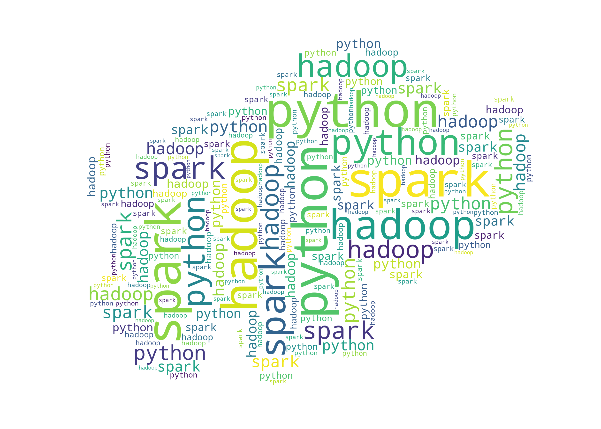

# python_practice_stepbystep

### 书籍<<Python在大数据平台的应用>> - 附书源码
更多信息请浏览：
----------------------------------------------------------------------------------------------

## Python在大数据平台上的应用
 
[第二章-安装大数据环境](python-on-bigdata/chapter2/chapter2_目录.md)  

[第三章-构建分析用数据](python-on-bigdata/chapter3/chapter3_目录.md)

[第四章-使用Python Snakebite管理HDFS](python-on-bigdata/chapter4/chapter4_code.ipynb)

[第五章-使用PyHive操作Hive](python-on-bigdata/chapter5/chapter5_connect-hive.ipynb)

[第六章-使用HappyBase操作HBase](python-on-bigdata/chapter6/chapter6_目录.md)

[第七章-Pig Python的操作](python-on-bigdata/chapter7/chapter7_目录.md)

[第八章-PySpark Shell](python-on-bigdata/chapter8/chapter8_目录.md)

[第九章-PySpark RDD操作](python-on-bigdata/chapter9/chapter9_目录.md)

[第十章-Spark DataFrame操作](python-on-bigdata/chapter10/chapter10_目录.md)

[第十一章-Spark Streaming操作](python-on-bigdata/chapter11/chapter11_目录.md)

[第十二章-Spark SQL操作](python-on-bigdata/chapter12/chapter12_目录.md)

[第十四章-数据分析](python-on-bigdata/chapter14/chapeter14_目录.md)                    

[第十五章-数据挖掘](python-on-bigdata/chapter15/chapeter15_目录.md)                    

[第十六章-数据可视化](python-on-bigdata/chapter16/chapeter16_目录.md)                    
