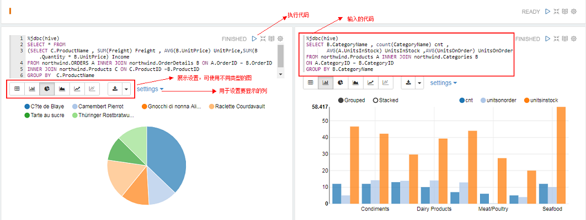
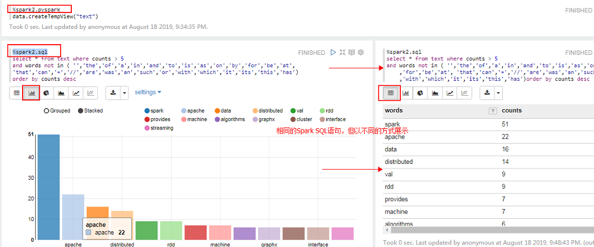
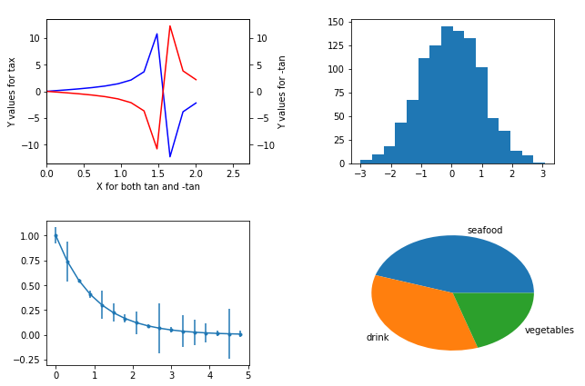
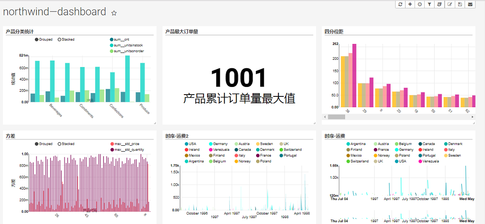

[WordCloud - 标签云-使用方式](./chapter16_wordcloud.ipynb)  

[WordCloud - 标签云-hdfs文件](./chapter16_wordcloud_hdfs.ipynb)  

[WordCloud - 标签云-Hive操作](./chapter16_wordcloud_hdfs.ipynb)  

[WordCloud - 标签云-PySpark操作](./chapter16_wordcloud_hdfs.ipynb)  

[WordCloud - 标签云-PySpark操作](./chapter16_wordcloud_hdfs.ipynb)  

[zeppelin的使用](./chapter16_zeppelin.json)  

[mathplotlib pyplot使用](./chapter16_mathplotlib_pyplot.ipynb)  

[mathplotlib Python方式使用](./chapter16_mathplotlib_python.py)  

[mathplotlib Pyspark ml操作](./chapter16_mathplot_pyspark_ml.ipynb)  

[mathplotlib Pyspark SQL操作](./chapter16_mathplot_spark_sql.py)  

[Superset操作](./chapter16_northwind_dashboard.pickle)  

