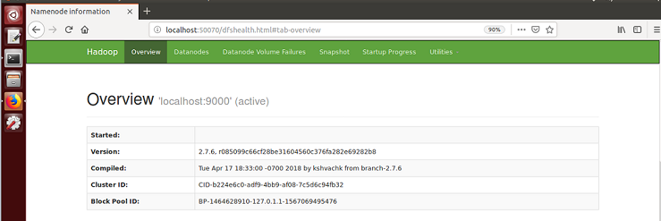
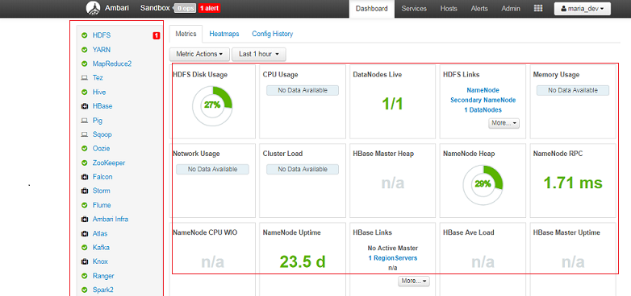
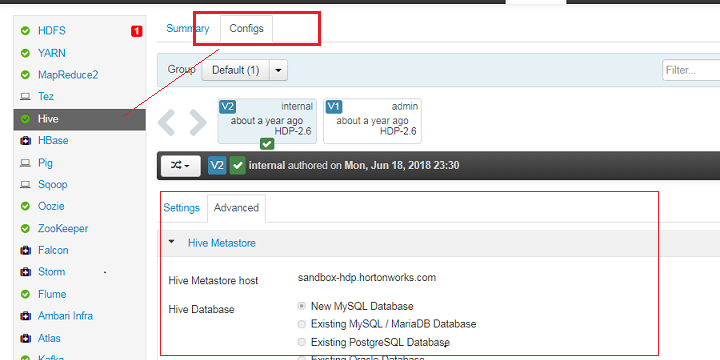

# 自己在虚拟机上安装大数据环境

## 1 安装ubuntu虚拟机

http://mirrors.aliyun.com/ubuntu-releases/ , 在阿里云镜像网站上，选项自己需要的ubuntu版本的ISO文件，在virtual box 或 vmware上进行安装。
但由于

为方便而言,开启root账号,安装过程中，都使用root账号。 
~~~shell
hadoop@ubuntu:~$ sudo passwd root
[sudo] password for hadoop: 
Enter new UNIX password: 
Retype new UNIX password: 
passwd: password updated successfully
hadoop@ubuntu:~$  
~~~

安装ssh服务,免密码登陆：
~~~shell
apt-get install openssh-server
.........(安装过程)

sudo service ssh start
vi /etc/ssh/sshd_config 
PermitRootLogin without-password  --> PermitRootLogin yes
~~~

## 2 安装JDK

https://www.oracle.com/technetwork/cn/java/javase/downloads/jdk8-downloads-2133151-zhs.html
到oracle官网下载JDK，在成功下载后，进行安装操作，按以下步骤操作：
~~~shell
* 1 解压 jdk 压缩包： tar -zxvf 
root@ubuntu:/usr# tar -zxvf jdk-8u11-linux-x64.tar.gz -C ./

* 2 修改文件夹名 
root@ubuntu:/usr# mv jdk1.8.0_11/ jvm

* 3 配置
root@ubuntu:/usr# vi /etc/profile
  添加以下的配置信息
  export JAVA_HOME=/usr/jvm
  export JRE_HOME=${JAVA_HOME}/jre  
  export CLASSPATH=.:${JAVA_HOME}/lib:${JRE_HOME}/lib   
  export PATH=${JAVA_HOME}/bin:$PATH
  
* 4 配置完成后的生效和查看  
root@ubuntu:/usr# source /etc/profile
root@ubuntu:/usr# java -version
java version "1.8.0_11"
Java(TM) SE Runtime Environment (build 1.8.0_11-b12)
Java HotSpot(TM) 64-Bit Server VM (build 25.11-b03, mixed mode)
~~~

## 3 安装anaconda开发环境

~~~shell
下载地址： https://repo.continuum.io/archive/index.html

* 1 可直至从浏览器下载，也可以使用下载工具wget ： wget https://repo.continuum.io/archive/Anaconda2-2019.07-Linux-x86_64.sh
下载完毕后，查看文件MD5值是否完整的下载 md5sum Anaconda2-2019.07-Linux-x86_64.sh 和官网的上的MD5值比较，确认是否完整下载。
否则的话,安装时会提示： ERROR: size of Anaconda3-2019.07-Linux-x86_64.sh should be    541906131 bytes

* 2 安装命令
bash Anaconda2-2019.07-Linux-x86_64.sh

在安装期间，首先会提示阅读并同意相关条款，按回车键即可。
In order to continue the installation process, please review the license
agreement.
Please, press ENTER to continue
>>> 

* 3 成功安装后,会提示是否进行初始化操作：输入 yes 
Do you wish the installer to initialize Anaconda2
by running conda init? [yes|no]
[no] >>> yes

初始化完成后，会出现以下的提示信息：
If you'd prefer that conda's base environment not be activated on startup, 
   set the auto_activate_base parameter to false: 

conda config --set auto_activate_base false
Thank you for installing Anaconda2!

* 4 验证查看安装的anaconda

(base) root@ubuntu:/usr/Anaconda2# conda --version
conda 4.7.10

* 5 安装需要的pthon库
打开 anaconda-navigator​
--(base) root@ubuntu:/usr/Anaconda2# conda install -c anaconda anaconda-navigator​
--Collecting package metadata (current_repodata.json): \ 
~~~

## 4 安装Hadoop 

官方网站下载地址 ：https://hadoop.apache.org/releases.html  
如下载速度太慢，可选择国内的镜像源,如清华大学开源镜像站：https://mirrors.tuna.tsinghua.edu.cn/apache/hadoop/common/
下载完安装包，后进行安装操作：

~~~shell
* 1 解压到当前目录
	tar --zxvf  hadoop-2.7.6.tar.gz -C ./ 
	  	
* 2 修改全局配置文件
	vi /etc/profile
	export HADOOP_HOME=/usr/hadoop-2.7.6
	export CLASSPATH=$($HADOOP_HOME/bin/hadoop classpath):$CLASSPATH
	export HADOOP_COMMON_LIB_NATIVE_DIR=$HADOOP_HOME/lib/native
	export PATH=$PAHT:$HADOOP_HOME/bin:$HADOOP_HOME/sbin
	配置文件路径  hadoop-2.7.6/etc/hadoop 下
	
	vi hadoop-env.sh
	export JAVA_HOME=/usr/JVM
	
	vi core-site.xml
	<configuration>
        <property>
             <name>hadoop.tmp.dir</name>
             <value>file:/usr/hadoop-2.7.6/tmp</value>
             <description>Abase for other temporary directories.</description>
        </property>
        <property>
             <name>fs.defaultFS</name>
             <value>hdfs://localhost:9000</value>
        </property>
	</configuration>
	
	/hdfs-site.xml
	<configuration>
        <property>
             <name>dfs.replication</name>
             <value>1</value>
        </property>
        <property>
             <name>dfs.namenode.name.dir</name>
             <value>file:/usr/hadoop-2.7.6/tmp/dfs/name</value>
        </property>
        <property>
             <name>dfs.datanode.data.dir</name>
             <value>file:/usr/hadoop-2.7.6/tmp/dfs/data</value>
        </property>
	</configuration>

	/maped-site.xml    
	(base) root@hadoop# cp mapred-site.xml.template mapred-site.xml
	
	<configuration>
	<property>
		<name>mapreduce.framework.name</name>
		<value>yarn</value>
		</property>
	</configuration>
	
	/yarn-site.xml
	 <property>
		<name>yarn.nodemanager.aux-services</name>
		<value>mapreduce_value</value>
	</property>

* 3 配置完成后，执行namenode的初始化并启动
	
	hdfs namenode -format
    启动namenode和datanode进程
	(base) root@hadoop-2.7.6# start-dfs.sh 
~~~

通过Web UI验证查看成功安装Hadoop
	
http://localhost:50070 在Web界面上可以查看配置信息是运行情况

	 
~~~shell
使用jps命令查看各项服务是否正常开启
(base) root@hadoop# jps
13697 DataNode
14599 Jps
13546 NameNode
13948 SecondaryNameNode

查看HDFS根目录下的文件
(base) root@hadoop# hdfs dfs -ls /
Found 2 items
drwxr-xr-x   - root supergroup          0 2019-08-29 02:14 /output_data    
drwxr-xr-x   - root supergroup          0 2019-08-29 22:54 /test_data	  

查看特定目录下的文件内容
(base) root@hadoop# hdfs dfs -cat /test_data/iris_dataset.csv
sepal_length,sepal_width,petal_length,petal_width,species
5.1,3.5,1.4,0.2,setosa
4.9,3,1.4,0.2,setosa
.....
~~~

## 5 hive安装 
使用 hive 1.2.2 解压即可运行，简单起见，使用默认的derby数据库，基本就无须配置了。下载地址：https://mirrors.tuna.tsinghua.edu.cn/apache/hive/
	解压到当前目录并重命名
	tar -zxvf apache-hive-1.2.2-bin.tar.gz ./
    mv apache-hive-1.2.2-bin apache-hive-1.2.2    
	
	vi /etc/profile  配置Hive环境

	export HIVE_HOME=/usr/hive-1.2.2    
    export PATH=$PATH:$HIVE_HOME/bin:$HIVE_HOME
	
	
	开启Hive，验证正确性：
	(base) root@hadoop# hive
	
	创建新数据库，并查看
	hive> CREATE DATABASE testdb;
	CREATE DATABASE testdb
	OK
	Time taken: 0.4 seconds
	
	hive> show databases;
	show databases
	OK
	default
	testdb
	Time taken: 0.012 seconds, Fetched: 2 row(s)
	hive> 
	
	创建表并装载数据
	hive> use testdb;
	...

	hive> CREATE TABLE iris_data(x1 string , x2 string , x3 string , x4 string , x5 string) 
	      ROW FORMAT DELIMITED
		  FIELDS TERMINATED BY ','
		  LINES TERMINATED BY '\n'
		  STORED AS TEXTFILE;
		...
	hive> LOAD DATA INPATH '/test_data/iris_dataset.csv' OVERWRITE INTO TABLE iris_data ; 
	LOAD DATA INPATH '/test_data/iris_dataset.csv' OVERWRITE INTO TABLE iris_data 
	Loading data to table testdb.iris_data
	Table testdb.iris_data stats: [numFiles=1, numRows=0, totalSize=3715, rawDataSize=0]
	OK
	Time taken: 0.779 seconds
	hive> SELECT * FROM iris_data LIMIT 10 ;
	SELECT * FROM iris_data LIMIT 10 
	OK
	iris_data.x1	iris_data.x2	iris_data.x3	iris_data.x4	iris_data.x5
	5.1	3.5	1.4	0.2	setosa
	4.9	3	1.4	0.2	setosa
	4.7	3.2	1.3	0.2	setosa
	...

## 6 spark 安装  
    选择和Hadoop版本对应的Spark，下载地址：https://mirrors.tuna.tsinghua.edu.cn/apache/spark/
	tar -zxvf spark-2.2.0-bin-hadoop2.7.tgz -C ./ 
	mv spark-2.2.0-bin-hadoop2.7 spark-2.2.0 
	
	配置文件： 
	/etc/profile 
	export SPAKR_HOME=/usr/spark-2.2.0
    export PAHT=$PATH:$SPARK_HOME/bin:$SPARK_HOME/sbin

	配置文件: spark-env.sh 
	JAVA_HOME=/usr/jvm
	SPARK_WORKER_MEMORY=3g

	验证查看，开启spark-shell
	(base) root@conf# spark-shell
	...
	Spark context Web UI available at http://192.168.223.129:4040
	Spark context available as 'sc' (master = local[*], app id = local-1567416119424).
	Spark session available as 'spark'
	
成功开后可查看Spark UI界面,进行验证。

## 7 kafka安装
	下载版本：kafka_2.11-0.10.0.0.tgz  下载地址：http://kafka.apache.org/downloads
	tar -zxvf kafka_2.11-0.10.0.0.tgz  -C ./ 
	bin/zookeeper-server-start.sh config/zookeeper.properties
	 
	验证： 
	开启zookeeper
		bin/zookeeper-server-start.sh config/zookeeper.properties     -- 开启一个终端，成功开启
	开启kafka ，开启一个新终端
	    bin/kafka-server-start.sh config/server.properties      
	定义一个新的topic   
	    bin/kafka-topics.sh --create --zookeeper localhost:2181 --replication-factor 1 --partitions 1 --topic test
		bin/kafka-topics.sh --list --zookeeper localhost:2181  用命令查看topic是否成功开启
	生产数据-开启消费者
		bin/kafka-console-producer.sh --broker-list localhost:9092 --topic test
		输入一些用于测试的字符串
	开启消费者，用于接收消息
		bin/kafka-console-consumer.sh --zookeeper localhost:2181 --topic test --from-beginning 
## 8 Apache Pig 安装
....
## 9 Apache HBase 安装
....

# 使用HDP SandBox大数据集成环境

HDP是Hortonworks推出的数据平台，提供的丰富的功能，且省去大量的安装和配置工作。HDP SandBox是可以很容易地开始使用Apache Hadoop、Apache Spark、Apache Hive、Apache HBase、Druid和Data Analytics Studio (DAS)，只需要下载安装ova文件，导入到虚拟化环境中即可，目前在支持虚拟化环境的有Virtual box、Vmware、Docker 。

自从 Hortonworks 和 Cloudera 两个目前主要的大数据平台开发商合并后，SandBox的下载地址也转移到：https://www.cloudera.com/downloads/hortonworks-sandbox/hdp.html

安装：下载对应的ova后，进行导入即可；随后的操作就和一般的虚拟机操作一样，但需要注意初次使用注意：开启Admin账号;各不同的账号的权限范围。

1 通过Ambari Web查看主要的服务。

2 查看各项服务配置信息。

--------------------------------------------------------------------------------------------------------

# 在Windows上安装Spark开发学习环境  

## 1准备：spark-2.4.2-bin-hadoop2.7 
		
      为了能让Spark在Windows上执行，需要使用一个工具winutils.exe，它是在Windows上的Hadoop的编译版本，下载地址 https://github.com/steveloughran/winutils/ 
	  在解压Spark安装包后，将winutils.exe拷贝到Spark解压目录下的bin目录下 ; 并为Spark的安装目录配置环境变量中。
	  安装Anaconda，安装对应的Windows版本，安装即可。
	  
## 2 检查查看，配置完毕后检查Spark是否能正常开启，在Anaconda Powershell Prompt ，输入spark-shell。
	  
	(base) PS C:\Users\Administrator> spark-shell.cmd
	  Welcome to
      ____              __
     / __/__  ___ _____/ /__
    _\ \/ _ \/ _ `/ __/  '_/
   /___/ .__/\_,_/_/ /_/\_\   version 2.4.2
      /_/

	Using Scala version 2.12.8 (Java HotSpot(TM) 64-Bit Server VM, Java 1.8.0_191)
	Type in expressions to have them evaluated.
	Type :help for more information.
	scala>
		
	在Anaconda Powershell Prompt ，输入spark-shell，后将会跳转到Jupyter Web界面 。